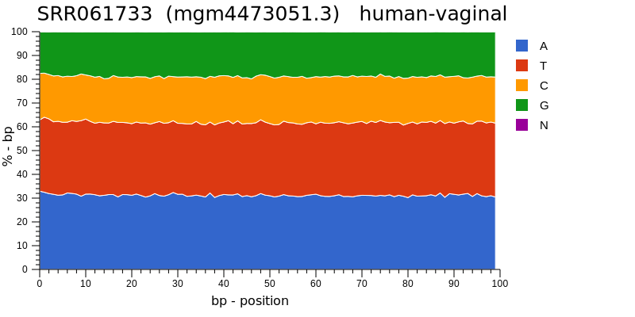
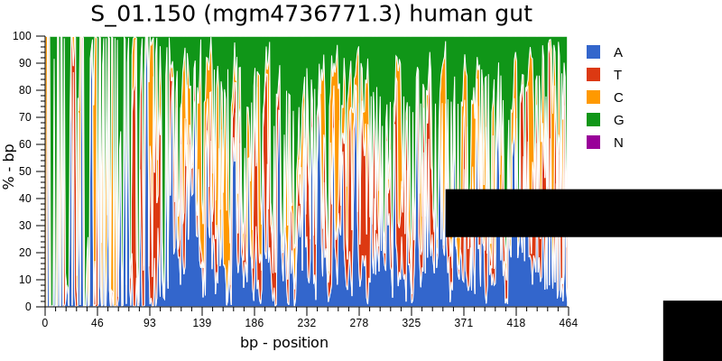
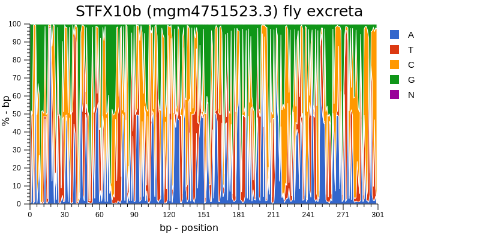
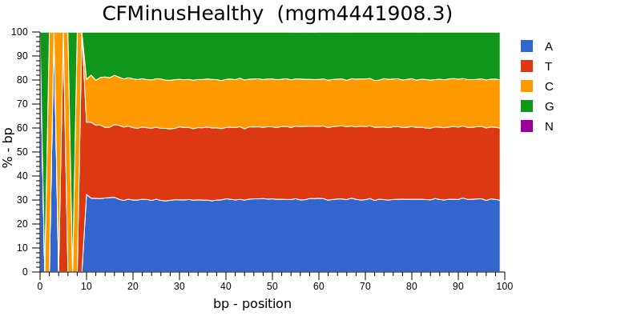
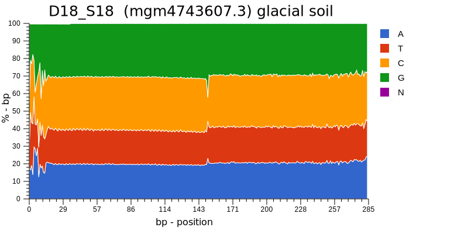
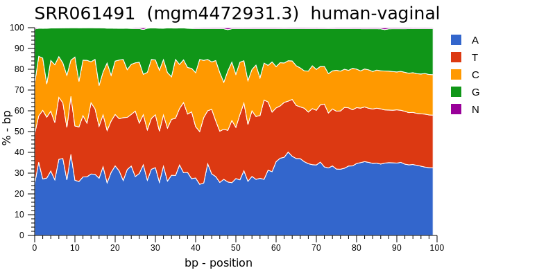
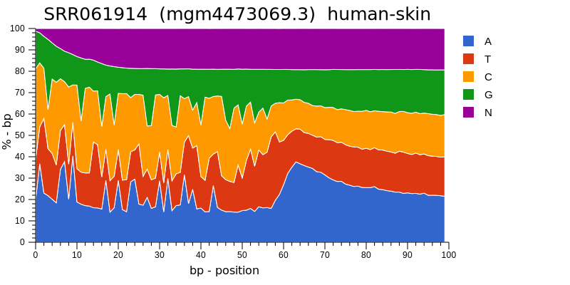
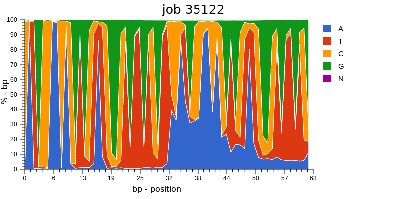
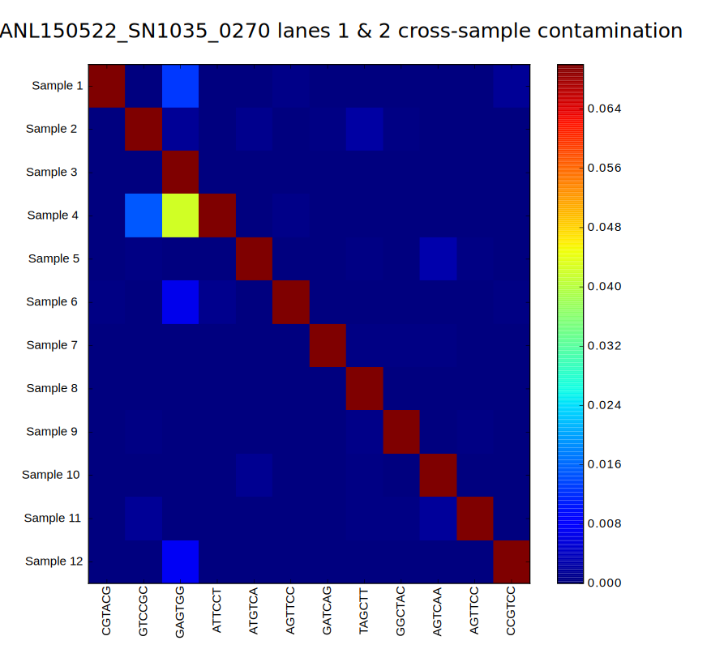

#High Throughput sequencing.  What could go wrong?
Will Trimble, Argonne National Laboratory

##Illumina flowcell videos
I made a tool [thumbnailpolish](https://github.com/wltrimbl/thumbnailpolish)  
to visualize what the Illumina machines are doing.

(http://www.mcs.anl.gov/~trimble/flowcell/hiseq-example.mp4)
(http://www.mcs.anl.gov/~trimble/flowcell/miseq-example.mp4)
(http://www.mcs.anl.gov/~trimble/flowcell/130315_SN1035_0127_AC1KU8ACXX-movie-lg.mov)
(You can find two of these videos on youtube)
[Illumina flowcells](http://tinyurl.com/sequencingisbeautiful)
[Flowcell rag](http://tinyurl.com/illuminaflowcellrag)

These sequencing machines produce FASTQ files.  

#The nucleotide profiles

These are (stacked line) plots of the nucleotide content as a funciton of position in the
read for datasets that we had the privilege to process at MG-RAST.

When you sequnece randomly selected, "shotgun" DNA, you expect about 25% A, C, G, and T,
independent of position on the read.

When you do amplicon sequencing, you see agreement--even "consensus" that varies
according to position.  Some people might call this "conservation"

This dataset has a preponderance of positions that are split close to 50:50 between 
two bases.  This is a 454 run with mixed reads, forward and reverse from the primer.

This is a 454 dataset with unanimous consensus for the first 10 bp.  Exceedingly 
good nucleotide persuasion?  These are artificial sequences that identify the sample
(and should have been removed before feeding them into similarity search analysis).

This dataset had a cycle where 10% of the reads were ambiguous bases, indicated
by IUPAC nucleotide code "N".  Depending on the application this might hurt the analysis
a lot or it might just reduce power.

This dataset has a noticeable discontinuity in GC content near 150 bp.  
This reflects the fact that the dataset is a mixture of 150 bp reads as they
came off the instrument and joined reads with lengths between 50 and 290bp.

Sometimes the illumina-made sequencing adapters (that contain the primers for in-vitro 
amplification of the DNA library) dimerize, causing them to appear at the beginning of
the sequences.  The data after the adapter might be salvageable.

And sometimes the adapters are half of the data

And sometimes the adapters are a quarter of the data.  For this dataset the 
basecaller gave up on about a quarter of the reads, and gave them poly-N basecalls.
These particular reads aren't useful, but they don't necessarily taint the rest of
the dataset.

This unfortunate dataset was 9 Gbases of adapters.  I jokingly call this 
9Gbases of "CopyrightIllumina2009CopyrightIllumina2009".  This sequencing
run could not be used for science and had to be re-done.

#Sequencing trainwrecks
At the Argonne sequencing core, we have seen lots of bad data, both that we've generated
ourself and that other people generated and asked us to bless or condemn.

#The UC shotgun story
 (Too little complexity)
Several shotgun samples in a project with a few dozen samples had low complexities --
a few kilobases would explain 70-90% of gigabases of dataset.  These ended up
being seemingly random microbial (and human) genes that amplified really well,
and thus ate up all the sequencing data.

#The UC RNAseq story
(Too little complexity)
Microbial RNA-seq expression experiment produced a handful of samples with very low complexity, 
4.5 kbases explained almost all of each datasets.  Investigation turned up E. coli SSU + 
E. coli LSU + B. subtilis SSU.  (Neither of these were the organism under study).  
Best explanation:  a small-subunit subtraction affinity column (used to reduce the rRNA 
fraction in RNAseq dataset) performed the wrong operation--it added artificial SSU DNA instead 
of subtracting it.

#The creative RNAseq story
One RNA-seq run a colleage asked us to look at had far, far more complexity than expected, billions of distinct kmers for a
< 10Mbase genome.   I call this the RNA polymerase that took a creative writing class.

#The diatom story
(About the right amount of complexity)
Once upon a time, when the Miseq was young, we had a single-celled eukaryote to sequence.  The instrument
purred along just fine, produced the nominal amount of healthy-looking data, but the customer said the 
data would not assemble.

The data had 5 Million 2x250 reads, so 2.5 Gbases, had a complexity consistent with a 50 Megabase genome, and looked
it provided 50x coverage of the genome.  It wasn't clear what the problem was.

Then I counted kmers of just the first 40 bases in each read.  It turns out that out of 5 Million reads, 
there were only 100k different starting points in the genome.    

PCR had exhausted the sample, and every template was present an average of 50 times in the output.
So this run procued really only 100k * 500bp = 50Mbases = 1x coverage, despite looking normal.

#The barcode confusion story
We were sequencing a dozen or so genomes for a corporate client.  A few of the genomes showed signs 
of 3-15x contamination with *something*, and this contamination was ruining the microbial assemblies.
We found that the contaminants were in fact from other genomes being sequenced on the same lane.
After some totally ad-hoc kmer-table wrangling, we found that some of our samples had 5% admixtures
from other samples with different barcodes.

This is, understandably, the conscientious scientist's nightmare, mixing up the labels.  

